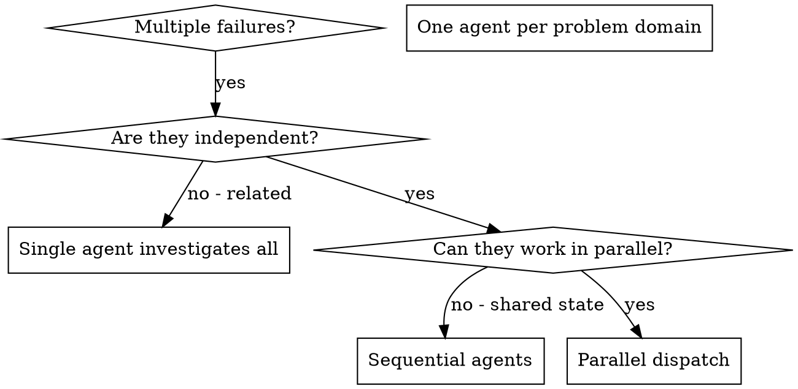

# Dispatching Parallel Agents

## Authorization

Use this skill only when the user explicitly requested subagents, delegation, or parallel agent work.

## Overview

You delegate tasks to specialized agents with isolated context. By precisely crafting their instructions and context, you ensure they stay focused and succeed at their task. They should never inherit your session's context or history — you construct exactly what they need. This also preserves your own context for coordination work.

When you have multiple unrelated failures (different test files, different subsystems, different bugs), investigating them sequentially wastes time. Each investigation is independent and can happen in parallel.

**Core principle:** Dispatch one agent per independent problem domain. Let them work concurrently.

## When to Use



**Use when:**
- 3+ test files failing with different root causes
- Multiple subsystems broken independently
- Each problem can be understood without context from others
- No shared state between investigations

**Don't use when:**
- Failures are related (fix one might fix others)
- Need to understand full system state
- Agents would interfere with each other

## The Pattern

### 1. Identify Independent Domains

Group failures by what's broken:
- File A tests: Tool approval flow
- File B tests: Batch completion behavior
- File C tests: Abort functionality

Each domain is independent - fixing tool approval doesn't affect abort tests.

### 2. Create Focused Agent Tasks

Each agent gets:
- **Specific scope:** One test file or subsystem
- **Clear goal:** Make these tests pass
- **Constraints:** Don't change other code
- **Role label:** A stable label in the first prompt line
- **Stop-hook handling:** Follow any Stop-hook prompt in that session, including required proof/checklist files. Fix blockers within assigned scope. Report to the orchestrator only when recovery needs out-of-scope changes, unrelated user work, credentials, or approval.
- **Expected output:** Summary of what you found and fixed

### 3. Dispatch in Parallel

```python
agent_tool_abort = Agent(
    subagent_type="coder",
    description="Fix agent-tool-abort tests",
    prompt="""Role label: agent-tool-abort

Fix the failures in src/agents/agent-tool-abort.test.ts.

Scope:
- Read only the abort-related test and implementation paths needed for this failure.
- Keep changes focused on abort behavior and its tests.
- Do not modify batch completion or tool approval race tests.

Stop-hook boundary:
Follow any Stop-hook prompt in this session, including required proof/checklist files. Fix blockers within your assigned scope. Report to the orchestrator only when recovery needs out-of-scope changes, unrelated user work, credentials, or approval.

Return: root cause, changed files, verification run, and remaining risk.
""",
)

batch_completion = Agent(
    subagent_type="coder",
    description="Fix batch-completion tests",
    prompt="""Role label: batch-completion

Fix the failures in src/agents/batch-completion-behavior.test.ts.

Scope:
- Read only the batch completion test and implementation paths needed for this failure.
- Keep changes focused on batch completion behavior.
- Do not modify abort or tool approval race tests.

Stop-hook boundary:
Follow any Stop-hook prompt in this session, including required proof/checklist files. Fix blockers within your assigned scope. Report to the orchestrator only when recovery needs out-of-scope changes, unrelated user work, credentials, or approval.

Return: root cause, changed files, verification run, and remaining risk.
""",
)

tool_approval_races = Agent(
    subagent_type="coder",
    description="Fix tool-approval-race tests",
    prompt="""Role label: tool-approval-races

Fix the failures in src/agents/tool-approval-race-conditions.test.ts.

Scope:
- Read only the tool approval race test and implementation paths needed for this failure.
- Keep changes focused on approval timing behavior.
- Do not modify abort or batch completion tests.

Stop-hook boundary:
Follow any Stop-hook prompt in this session, including required proof/checklist files. Fix blockers within your assigned scope. Report to the orchestrator only when recovery needs out-of-scope changes, unrelated user work, credentials, or approval.

Return: root cause, changed files, verification run, and remaining risk.
""",
)

# Print the roster immediately after spawn using the returned agent ids:
# agent-tool-abort: <agent id> [coder]
# batch-completion: <agent id> [coder]
# tool-approval-races: <agent id> [coder]
```

### 4. Review and Integrate

Wait for the spawned agents before integrating:

```python
TaskOutput(agent_tool_abort, block=true)
TaskOutput(batch_completion, block=true)
TaskOutput(tool_approval_races, block=true)
```

When agents return:
- Read each summary
- Review every changed line before accepting it
- Verify fixes don't conflict
- Run full test suite
- Integrate all changes only after review

## Agent Prompt Structure

Good agent prompts are:
1. **Focused** - One clear problem domain
2. **Self-contained** - All context needed to understand the problem
3. **Specific about output** - What should the agent return?
4. **Labeled** - First line is `Role label: <stable-role>`
5. **Bounded** - Includes Stop-hook handling: follow prompts and proof/checklist steps in-session, fix in-scope blockers, and report only out-of-scope blockers.

```markdown
Role label: agent-tool-abort

Fix the 3 failing tests in src/agents/agent-tool-abort.test.ts:

1. "should abort tool with partial output capture" - expects 'interrupted at' in message
2. "should handle mixed completed and aborted tools" - fast tool aborted instead of completed
3. "should properly track pendingToolCount" - expects 3 results but gets 0

These are timing/race condition issues. Your task:

1. Read the test file and understand what each test verifies
2. Identify root cause - timing issues or actual bugs?
3. Fix by:
   - Replacing arbitrary timeouts with event-based waiting
   - Fixing bugs in abort implementation if found
   - Adjusting test expectations if testing changed behavior

Do NOT just increase timeouts - find the real issue.

Stop-hook boundary:
Follow any Stop-hook prompt in this session, including required proof/checklist files. Fix blockers within your assigned scope. Report to the orchestrator only when recovery needs out-of-scope changes, unrelated user work, credentials, or approval.

Return: Summary of what you found and what you fixed.
```

## Common Mistakes

**❌ Too broad:** "Fix all the tests" - agent gets lost
**✅ Specific:** "Fix agent-tool-abort.test.ts" - focused scope

**❌ No context:** "Fix the race condition" - agent doesn't know where
**✅ Context:** Paste the error messages and test names

**❌ No constraints:** Agent might refactor everything
**✅ Constraints:** "Do NOT change production code" or "Fix tests only"

**❌ Vague output:** "Fix it" - you don't know what changed
**✅ Specific:** "Return summary of root cause and changes"

## When NOT to Use

**Related failures:** Fixing one might fix others - investigate together first
**Need full context:** Understanding requires seeing entire system
**Exploratory debugging:** You don't know what's broken yet
**Shared state:** Agents would interfere (editing same files, using same resources)

## Real Example from Session

**Scenario:** 6 test failures across 3 files after major refactoring

**Failures:**
- agent-tool-abort.test.ts: 3 failures (timing issues)
- batch-completion-behavior.test.ts: 2 failures (tools not executing)
- tool-approval-race-conditions.test.ts: 1 failure (execution count = 0)

**Decision:** Independent domains - abort logic separate from batch completion separate from race conditions

**Dispatch:**
```
Use the three `Agent` calls from "Dispatch in Parallel" with role labels:
agent-tool-abort
batch-completion
tool-approval-races

roster:
agent-tool-abort: <agent id> [coder]
batch-completion: <agent id> [coder]
tool-approval-races: <agent id> [coder]

wait:
TaskOutput(agent_tool_abort, block=true)
TaskOutput(batch_completion, block=true)
TaskOutput(tool_approval_races, block=true)
```

**Results:**
- Agent 1: Replaced timeouts with event-based waiting
- Agent 2: Fixed event structure bug (threadId in wrong place)
- Agent 3: Added wait for async tool execution to complete

**Integration:** All fixes independent, no conflicts, full suite green

**Time saved:** 3 problems solved in parallel vs sequentially

## Key Benefits

1. **Parallelization** - Multiple investigations happen simultaneously
2. **Focus** - Each agent has narrow scope, less context to track
3. **Independence** - Agents don't interfere with each other
4. **Speed** - 3 problems solved in time of 1

## Verification

After agents return:
1. **Review each summary** - Understand what changed
2. **Check for conflicts** - Did agents edit same code?
3. **Run full suite** - Verify all fixes work together
4. **Spot check** - Agents can make systematic errors

## Real-World Impact

From debugging session (2025-10-03):
- 6 failures across 3 files
- 3 agents dispatched in parallel
- All investigations completed concurrently
- All fixes integrated successfully
- Zero conflicts between agent changes
